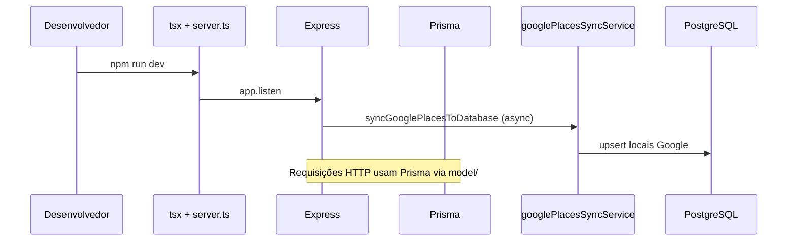
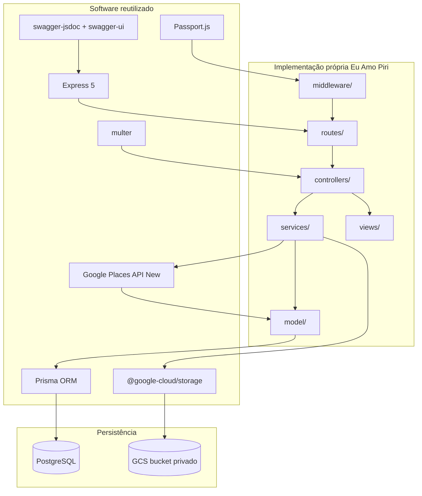

# Reutilização de Software no Backend — Visão Geral

Documento de síntese do módulo **Reutilização de Software** no escopo do backend da aplicação **Eu Amo Piri**. A redação está em terceira pessoa e descreve o que a equipe implementou, por quê, quais bibliotecas ou serviços externos foram reutilizados e como essa reutilização se encaixa na arquitetura do projeto.

---

## 1. Contexto do backend

O backend do Eu Amo Piri é uma **API REST** em **Node.js + TypeScript**. A equipe organizou o código em camadas inspiradas em **Clean Architecture** (Martin, 2017): controllers e routes na borda, services como casos de uso, models como acesso a dados — sem rigor formal de inversão de dependência em todos os módulos, mas com **adaptadores explícitos** (`storageService`, `googlePlacesService`) onde a integração com terceiros ocorre.

A reutilização concentra-se em **componentes COTS** (Commercial Off-The-Shelf) para capacidades genéricas (HTTP, ORM, criptografia, object storage), reservando implementação própria para **regras de domínio** de Pirenópolis: taxonomia de locais, moderação comunitária, blacklist lexical e tradução de contratos Google → vocabulário interno.

Cada biblioteca é avaliada por **atributo de qualidade** afetado (Bass, Clements & Kazman — *Software Architecture in Practice*): segurança, modificabilidade, testabilidade e interoperabilidade — não apenas por “facilidade de uso”.

---

## 2. Infraestrutura transversal

As bibliotecas e serviços **transversais** reutilizados por todos os módulos funcionais do backend. A equipe tratou essa camada como **fundação compartilhada**: uma vez configurada, autenticação, locais, relatos, comentários e moderação passam a consumi-la sem duplicar infraestrutura.

### 2.1 O que foi implementado

- Servidor HTTP centralizado em `backend/src/server.ts`;
- Registro modular de rotas (`/auth`, `/places`, `/admin`);
- Persistência relacional via Prisma sobre PostgreSQL;
- Documentação interativa OpenAPI em `/api-docs`;
- Pipeline de testes unitários com Vitest;
- Suporte a ambientes local (Docker) e produção (Supabase) via variáveis de ambiente.

### 2.2 Bibliotecas reutilizadas

| Biblioteca | Padrão / estilo (GoF ou Fowler) | O que faz | Por que utilizamos | Trade-off |
| --- | --- | --- | --- | --- |
| **Express 5** | *Layered architecture* — camada de entrega HTTP | Roteamento, middleware chain, parsing JSON | Ecossistema maduro; encadeamento de middlewares alinha-se ao pipeline de auth/upload | Express 5 é major recente; API estável mas menor base de exemplos que v4 |
| **Prisma + PostgreSQL** | *Repository* (Fowler, PoEAA) — abstração de persistência | ORM type-safe, migrations versionadas | Elimina SQL ad hoc; schema como artefato versionado | Vendor lock-in moderado ao Prisma; queries complexas exigem `$queryRaw` |
| **cors** | Política de segurança de fronteira | Habilita CORS browser → API | Origens distintas (Vite `:5173`, API `:3000`) | Lista de origens deve ser mantida em produção — configuração incorreta expõe API |
| **swagger-jsdoc** | Documentação como contrato | OpenAPI 3.0 + UI `/api-docs` | Contrato HTTP co-localizado com rotas | Duplicação anotação JSDoc ↔ tipos TS; risco de drift se rota mudar sem atualizar `@openapi` |
| **dotenv** | Externalização de configuração | Variáveis de ambiente por arquivo | Segredos fora do Git (JWT, GCS, DB) | `.env` local não substitui secret manager em produção |
| **Vitest** | Testes na base da pirâmide (Fowler) | Unit tests ESM/TS | Feedback rápido sem subir stack completa | Cobertura ainda parcial — services críticos priorizados |
| **tsx** | Tooling de dev | TS sem build prévio | Reduz atrito no ciclo edit-run | Não usado em produção — deploy exigiria `tsc` ou bundler |

**Integração:** `backend/src/server.ts`, `backend/src/config/prisma.ts`, `backend/src/config/swagger.ts`, `backend/prisma/schema.prisma`.

### 2.3 Fluxo de bootstrap da API

No startup, a equipe **reutiliza o pipeline Express existente** e acopla o sync Google como tarefa assíncrona — falha no sync não derruba a API.

### 2.4 Senso crítico

| Escolha | Crítica da equipe |
| --- | --- |
| Express 5 (major recente) | Benefício: ecossistema atual; risco: menor maturidade que v4 — mitigado por escopo REST simples |
| Prisma 7 | Client gerado fora de `node_modules` — exige `prisma generate` pós-clone, documentado no README |
| Swagger via JSDoc | Duplicação leve entre anotações e tipos TS — aceita em troca de UI interativa sem YAML separado |

---

## 3. Mapa de módulos por requisito

| Documento | RF | Módulo funcional | Bibliotecas ou serviços reutilizados |
| --- | --- | --- | --- |
| [RF01 — Autenticação](/ArquiteturaReutilizacao/backend/02.Autenticacao.md) · [4.4](/requisitos/RF01-backend/4.4.Autenticacao.md) | RF01 | Login, cadastro, JWT | Passport.js, passport-local, passport-jwt, bcrypt, jsonwebtoken |
| [RF03 — Perfil e GCS](/ArquiteturaReutilizacao/backend/03.PerfilArmazenamento.md) · [4.5](/requisitos/RF03-backend/4.5.EdicaoPerfil.md) | RF03 | Foto de perfil | @google-cloud/storage, multer |
| [RF12/RF13 — Comentários e reações](/ArquiteturaReutilizacao/backend/04.ComentariosReacoes.md) · [4.6](/requisitos/RF12-RF13-backend/4.6.ComentariosReacoes.md) | RF12, RF13 | Interações sociais | Prisma, Passport JWT, Vitest (reuso interno de blacklist e MVC) |
| [RF11 — Denúncia e moderação](/ArquiteturaReutilizacao/backend/05.DenunciaModeracao.md) · [4.7](/requisitos/RF-denuncia-backend/4.7.DenunciaModeracao.md) | RF11 | Moderação de conteúdo | Prisma, Passport JWT, middlewares de papel |
| [RF15 — Google Places](/ArquiteturaReutilizacao/backend/06.SincronizacaoGooglePlaces.md) · [4.8](/requisitos/RF-google-places-backend/4.8.SincronizacaoGooglePlaces.md) | RF15 | Locais importados | Google Places API (New), `fetch` nativo Node.js |
| [RF04/RF07 — Locais Morador](/ArquiteturaReutilizacao/backend/07.LocaisMorador.md) · [rf04](/requisitos/rf04-cadastro-local.md) · [rf07](/requisitos/rf07-edicao-locais.md) | RF04, RF07, RF10 | CRUD de locais | multer, `storageService`, `photoValidation`, Passport JWT |
| [RF05/RF08/RF09 — Relatos](/ArquiteturaReutilizacao/backend/08.RelatosExperiencia.md) · [rf08](/requisitos/rf08-edicao-relatos.md) | RF05, RF08, RF09, RNF01–05 | Relatos e painéis | Prisma, multer, GCS, `blacklist.ts` |
| [RF06 — Consulta pública](/ArquiteturaReutilizacao/backend/09.ConsultaPublica.md) | RF06 | Listagem e detalhe | Prisma, `placeView`, proxy GCS/Google, `optionalAuthMiddleware` |

A **infraestrutura transversal** (Express, Prisma, Swagger, cors, Vitest) está descrita na [§ 2](#2-infraestrutura-transversal) deste documento.

Documentos de reutilização detalhada por requisito (com diagramas e ADRs) permanecem em [`docs/requisitos/`](/docs/requisitos/RF01-backend/4.4.Autenticacao.md). Esta pasta complementa esses artefatos com foco explícito em **reutilização de software**.

---

## 4. Arquitetura em camadas e papel da reutilização

| Camada | Responsabilidade própria | O que é delegado a bibliotecas |
|--------|--------------------------|----------------------------------|
| `server.ts` | Bootstrap, CORS, sync Google no startup | Express, cors, swagger-ui-express, passport.initialize |
| `routes/` + `controllers/` | Contratos HTTP e status codes | — |
| `services/` | Regras de negócio (moderação, sync, perfil) | Chamadas a GCS e Google Places isoladas em adaptadores |
| `model/` | Queries e persistência | Prisma Client |
| `middleware/` | Auth, upload, papéis de usuário | passport-jwt, multer |
| `config/` | Wiring de estratégias e OpenAPI | passport-local, swagger-jsdoc |

---

## 5. Padrões de projeto e princípios aplicados

Mapeamento explícito aos padrões descritos por **Gamma et al.** (*Design Patterns*, 1994) e extensões de **Fowler** (*Patterns of Enterprise Application Architecture*, 2002):

| Padrão | Onde no Eu Amo Piri | Problema que resolve | Limitação no escopo atual |
| --- | --- | --- | --- |
| **Facade** | `passport.authenticate()`, `authFacade` (FE), `storageService` | Interface única sobre subsistemas complexos (auth, GCS) | Facade pode acumular responsabilidades se não houver services por domínio |
| **Strategy** | `passport-local`, `passport-jwt`; `placeCategoryMapper` | Algoritmos de auth/mapeamento intercambiáveis | Novas estratégias (ex.: OAuth) exigem wiring em `passport.ts` |
| **Adapter** | `googlePlacesService`, `authMapper`, adaptadores FE (`placeAdaptor`) | Traduz contrato externo → modelo interno | Duplicação de DTOs entre view e mapper |
| **Proxy** | `GET /places/:id/cover`, `GET /auth/me/photo` (BFF) | Controla acesso a recursos remotos; oculta credenciais | Backend vira gargalo de bandwidth para imagens em escala |
| **Template Method** (implícito) | Pipeline `routes → controller → service → model → view` | Esqueleto fixo; passos variam por RF | Nem todos os controllers delegam 100% a services — exceções pontuais |
| **DIP** (SOLID) | `profileService` → `storageService` → GCS SDK | Domínio não depende de SDK concreto | Nem todo service usa porta explícita — dívida técnica aceita no prazo |

**Reuso interno (white-box):** módulos RF12/13 e denúncia **não** adicionaram dependências npm — reutilizaram `authMiddleware`, `blacklist.ts` e esqueleto MVC de relatos. Isso materializa **modificabilidade** (Bass et al.) com custo de acoplamento temporal entre módulos.

---

## 6. Inventário consolidado de dependências npm (backend)

| Biblioteca | Versão (`package.json`) | Módulos que consomem |
|------------|-------------------------|----------------------|
| express | ^5.2.1 | Todos |
| @prisma/client + prisma | ^7.8.0 | Todos (persistência) |
| passport + passport-local + passport-jwt | ^0.7.0 / ^1.0.0 / ^4.0.1 | Auth, perfil, relatos, comentários, denúncia, admin |
| bcrypt + jsonwebtoken | ^6.0.0 / ^9.0.3 | Auth |
| @google-cloud/storage | ^7.21.0 | Perfil, fotos de relatos |
| multer | ^2.2.0 | Perfil, fotos de relatos |
| cors | ^2.8.6 | Infraestrutura |
| swagger-jsdoc + swagger-ui-express | ^6.3.0 / ^5.0.1 | Infraestrutura |
| dotenv | ^17.4.2 | Configuração |
| pg + @prisma/adapter-pg | ^8.21.0 / ^7.8.0 | Driver PostgreSQL |
| vitest | ^1.6.0 (dev) | Testes unitários |

**Serviços externos sem SDK dedicado:** Google Places API (New) — consumida via `fetch` nativo do Node.js 18+.

---

## 7. Facilidade no desenvolvimento — síntese por fase

A tabela resume **o que cada reutilização facilitou na prática** para a equipe, fase a fase do backend. Os detalhes por RF estão nos módulos 02–06.

| Fase do desenvolvimento | Biblioteca / serviço | Facilidade trazida | No que ajudou concretamente |
|-------------------------|----------------------|--------------------|-----------------------------|
| **Bootstrap da API** | Express + tsx | Subir servidor e rotas em horas, sem HTTP manual | `npm run dev` funcional após clone; novos endpoints seguem o mesmo padrão `router → controller` |
| **Persistência** | Prisma + PostgreSQL | Schema declarativo e migrations versionadas no Git | Novos RFs (comentários, denúncia, Google sync) = alterar `schema.prisma` + migration, sem reescrever SQL |
| **Integração frontend** | cors | Uma linha de configuração resolve bloqueio do navegador | Login, listagem e upload multipart testáveis entre Vite `:5173` e API `:3000` |
| **Documentação e demo** | Swagger | UI interativa sem Postman obrigatório | Professora e equipe testam JWT, sync admin e denúncia direto em `/api-docs` |
| **Autenticação (RF01)** | Passport + bcrypt + JWT | Login e rotas protegidas sem implementar criptografia | Proteger nova rota = importar `authMiddleware`; hash de senha = duas funções (`hash`/`compare`) |
| **Perfil e fotos (RF03)** | multer + GCS SDK | Upload multipart e bucket resolvido por middleware + 3 funções | Equipe focou em `profileService` (regras); não parseou `multipart` nem assinou URLs GCS manualmente |
| **Comentários/reações (RF12/13)** | Reuso Prisma + JWT + MVC | Zero dependência nova; copiar esqueleto de `experience*` | Entrega em paralelo: auth, blacklist e validação Local→Relato já existiam |
| **Denúncia/moderação** | Reuso Prisma + middlewares de papel | Papéis turista/admin já prontos do RF01 | Fila admin e POST `/report` montados com mesma cadeia de middlewares |
| **Google Places** | Places API + fetch | Dezenas de POIs sem seed manual nem geocoder próprio | Sync no startup popula `/locais`; frontend usa o mesmo `GET /places` já existente |
| **Locais morador (RF04/07)** | Reuso multer + GCS + JWT | Cadastro/edição sem nova lib de upload | `placeService` copia pipeline de `profileService`; `photoValidation` compartilhado |
| **Relatos (RF05/08/09)** | Reuso Prisma + blacklist + GCS | Publicação e painéis sem dependência nova | `validateExperienceInput` centraliza RNF01–03; RF09 via `GET /auth/me/experiences` |
| **Consulta (RF06)** | Reuso Prisma + views + proxy | Listagem unificada morador + Google | `GET /places` único; busca/filtro categoria no frontend |
| **Qualidade** | Vitest | Testes rápidos sem subir servidor | Refatorar mappers e services com feedback imediato (`npm test`) |

---

## 8. Impacto global — análise por atributo de qualidade

| Atributo (Bass et al.) | Efeito da reutilização | Risco residual |
| --- | --- | --- |
| **Segurança** | bcrypt + JWT stateless; GCS privado; proxy de mídia | JWT sem refresh token — logout depende de expiração; blacklist de tokens não implementada |
| **Modificabilidade** | MVC repetível; Prisma migrations; adaptadores isolam Google/GCS | Acoplamento Prisma ↔ services — trocar ORM exigiria refactor amplo |
| **Interoperabilidade** | OpenAPI + JSON REST; enum alinhado FE/BE (`ReportReason`) | Contrato Google Places externo — breaking changes na API Google afetam sync |
| **Testabilidade** | Vitest em services/mappers; mocks de Prisma | Cobertura E2E limitada — fluxos críticos validados manualmente + Swagger |
| **Desempenho** | JWT evita sessão server-side; PostgreSQL indexado | Sync Google no startup pode atrasar cold start; sem cache distribuído de fotos |
| **Disponibilidade** | Sync Google falha silenciosamente — API sobe mesmo sem POIs Google | Dados Google podem ficar desatualizados até próximo restart/sync manual |

---

## 9. O que a equipe implementou (não reutilizou de biblioteca)

| Área | Implementação própria |
|------|-------------------------|
| Domínio | Models Prisma, enums (`AccountType`, `PlaceCategory`, `ContentStatus`, `ReactionType`) |
| Regras | Toggle de reações, fila de moderação, blacklist de linguagem, validação Local → Relato → Comentário |
| Integração Google | `placeCategoryMapper`, `piriRegion`, sync top-N por categoria, upsert no PostgreSQL |
| Views JSON | `placeView`, `experienceView`, `commentView`, `userView` — contrato da API |
| Autorização | `requireAccountTypeMiddleware` (turista, morador, admin) |

---

## 10. Evidência de execução

| Verificação | Como reproduzir |
|-------------|-----------------|
| API online | `cd backend && npm run dev` → `GET http://localhost:3000` |
| Swagger | `http://localhost:3000/api-docs` |
| Testes | `cd backend && npm test` |
| Sync Google Places | Log no startup ou `POST /places/gmaps/sync` (admin) |
| Upload perfil | `PATCH /auth/me` multipart + `GET /auth/me/photo` |

---

## 11. Referências bibliográficas

| Referência | Aplicação no documento |
| --- | --- |
| Gamma, Helm, Johnson, Vlissides — *Design Patterns: Elements of Reusable Object-Oriented Software* (Addison-Wesley, 1994) | Facade, Strategy, Adapter, Proxy — § 5 |
| Fowler — *Patterns of Enterprise Application Architecture* (Addison-Wesley, 2002) | Repository (Prisma), Gateway (APIs Google) |
| Martin — *Clean Architecture* (Prentice Hall, 2017) | Camadas, DIP em `storageService` |
| Martin — princípios SOLID | SRP (`api/auth/`), OCP (composição de componentes FE) |
| Bass, Clements, Kazman — *Software Architecture in Practice* (4th ed.) | Atributos de qualidade — § 1, § 8 |
| Richards & Ford — *Fundamentals of Software Architecture* (O'Reilly, 2020) | Trade-off analysis entre bibliotecas |

## 12. Referências cruzadas (projeto)

- [4.2. Módulo Reutilização de Software](/docs/ArquiteturaReutilizacao/4.2.ReutilizacaoDeSoftware.md)
- [4. Arquitetura & Reutilização — índice geral](/docs/ArquiteturaReutilizacao/4.ArquiteturaReutilizacao.md)
- [README do backend](/backend/README.md)
- Visões por RF: [4.4](/docs/requisitos/RF01-backend/4.4.Autenticacao.md) · [4.5](/docs/requisitos/RF03-backend/4.5.EdicaoPerfil.md) · [4.6](/docs/requisitos/RF12-RF13-backend/4.6.ComentariosReacoes.md) · [4.7](/docs/requisitos/RF-denuncia-backend/4.7.DenunciaModeracao.md) · [4.8](/docs/requisitos/RF-google-places-backend/4.8.SincronizacaoGooglePlaces.md) · [07 Locais](/ArquiteturaReutilizacao/backend/07.LocaisMorador.md) · [08 Relatos](/ArquiteturaReutilizacao/backend/08.RelatosExperiencia.md) · [09 Consulta](/ArquiteturaReutilizacao/backend/09.ConsultaPublica.md)

---

## 13. Histórico de versões

| Versão | Data | Descrição |
| --- | --- | --- |
| 1.0 | 21/06/2026 | Grupo 05 Eu Amo Piri — documentação modular de reutilização no backend |
| 1.1 | 21/06/2026 | Seção de facilidade no desenvolvimento por fase |
| 1.2 | 21/06/2026 | Infraestrutura transversal integrada à visão geral; mapa por RF |
| 1.3 | 21/06/2026 | Embasamento em Design Patterns (GoF), SOLID e atributos de qualidade (Bass et al.) |
| 1.4 | 21/06/2026 | Módulos RF04–RF10 e RNFs — locais, relatos e consulta pública |
