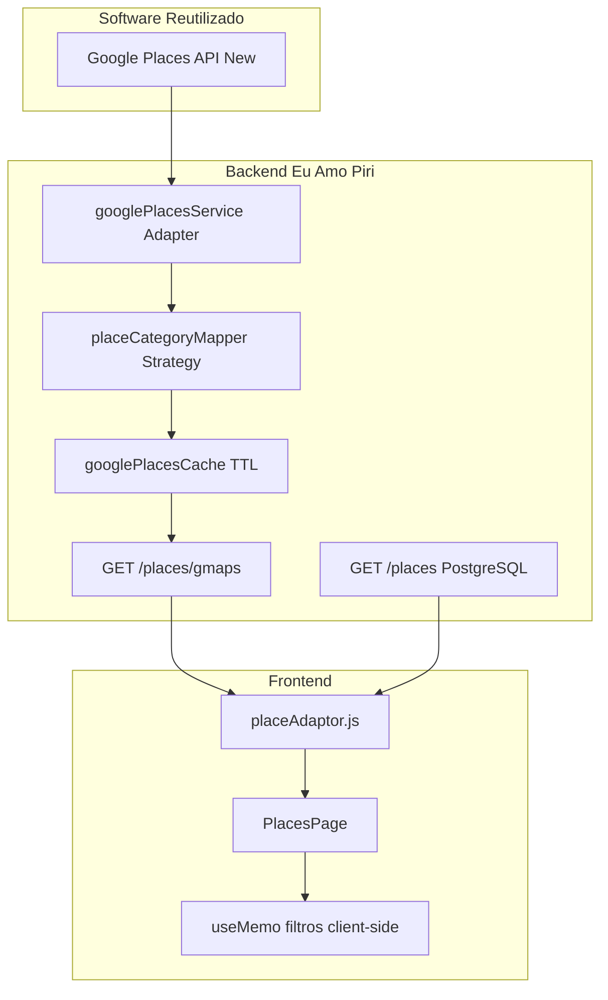
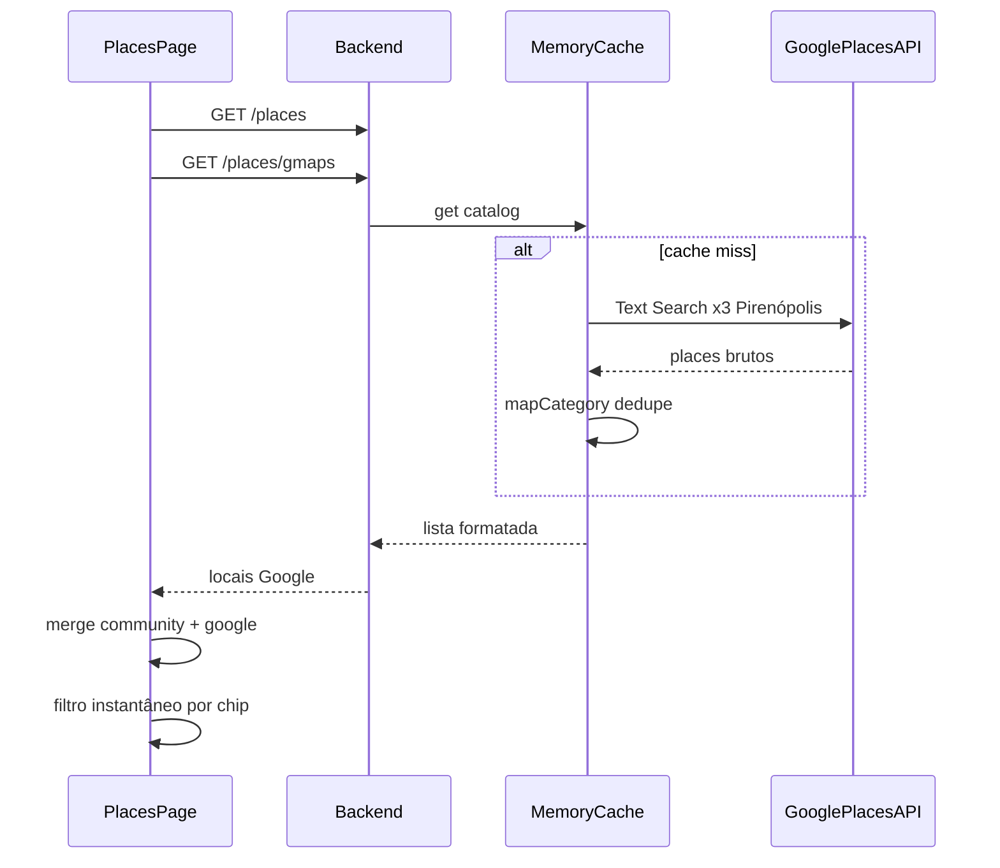

# 4.8. Catálogo Google Places — Pirenópolis (Visão Arquitetural)

Documento técnico para o DAS (Documento de Arquitetura de Software) e o módulo de Reutilização de Software do projeto **Eu Amo Piri**.

---

## 1. Introdução e contexto

O Eu Amo Piri é uma aplicação web para compartilhar experiências sobre **Pirenópolis**. Antes deste módulo, o catálogo de locais dependia exclusivamente de **cadastro manual** por moradores (`Place` no PostgreSQL), o que limitava a cobertura inicial da plataforma.

Este requisito integra a **Google Places API (New)** como **fonte principal de dados geográficos** do sistema:

| Fonte | Endpoint | Papel |
|-------|----------|-------|
| **Google Places (sincronizados)** | `GET /places` | Top 20 por categoria persistidos no PostgreSQL — página de detalhe, relatos, mapa |
| **Google Places (catálogo extra)** | `GET /places/gmaps` | Demais POIs — exibidos na plataforma (mapa + página de consulta), **sem relatos** |
| **Comunidade** | `GET /places` | Locais cadastrados por moradores + relatos e fotos autênticas |

Na inicialização (ou via `POST /places/gmaps/sync`), o backend consulta a Google Places API, **persiste os 20 melhores por categoria** (restaurantes, cachoeiras, pousadas) e mantém o restante em **cache em memória** para exibição paginada.

---

## 2. Reutilização de software

| Componente | Origem | Papel no Eu Amo Piri |
|---|---|---|
| **Google Places API (New)** | [Google Maps Platform](https://developers.google.com/maps/documentation/places/web-service/op-overview) | Base externa de POIs, geolocalização e metadados |
| **Text Search (`places:searchText`)** | Google Maps Platform | Busca textual delimitada à região de Pirenópolis |
| **`fetch` nativo (Node.js 18+)** | Node.js | Cliente HTTP para a API Google (sem SDK adicional) |
| **Cache em memória** | Implementação própria | Reduz cota, latência e dependência em tempo real |
| **Express + Vitest** | npm | Endpoint REST e testes automatizados |
| **React + useMemo** | npm (frontend) | Filtro client-side instantâneo |

### O que foi reutilizado vs. implementado pelo projeto

| Reutilizado (serviço/biblioteca externa) | Implementado pelo Eu Amo Piri |
|---|---|
| Base global de lugares do Google | `placeCategoryMapper.ts` — tradução `lodging`→Pousada, `restaurant`→Restaurante, `natural_feature`/nome "Cachoeira"→Cachoeira |
| Geocoding e endereços formatados | `piriRegion.ts` — centro, raio e queries de Pirenópolis |
| Avaliações e fotos do Google | `googlePlacesService.ts` — Adapter/Facade + DTO unificado |
| Infraestrutura HTTP do Node | `googlePlacesCache.ts` — Cache-aside com TTL configurável |
| UI de listagem existente | Chips de categoria, mesclagem no `placeAdaptor.js` |

**Por que reutilizar o Google em vez de construir do zero?**

1. **Cobertura imediata** — dezenas/centenas de POIs em Pirenópolis sem seed manual.
2. **Qualidade geográfica** — coordenadas e endereços mantidos pelo ecossistema Google.
3. **Custo de oportunidade** — evita implementar geocoding, base cartográfica e curadoria própria.
4. **Diferencial do Eu Amo Piri** — não compete com o Google Maps genérico; **filtra, categoriza para o domínio local** e **enriquece com relatos da comunidade**.

---

## 3. Como funciona a Google Places API neste módulo

### 3.1 Text Search (New)

O backend envia requisições `POST` para:

```
https://places.googleapis.com/v1/places:searchText
```

**Headers:**

| Header | Valor |
|--------|-------|
| `Content-Type` | `application/json` |
| `X-Goog-Api-Key` | `GOOGLE_MAPS_API_KEY` (somente backend) |
| `X-Goog-FieldMask` | Campos solicitados (id, displayName, location, types, rating, etc.) |

**Corpo (exemplo simplificado):**

```json
{
  "textQuery": "cachoeira em Pirenópolis GO",
  "locationBias": {
    "circle": {
      "center": { "latitude": -15.8503, "longitude": -48.9571 },
      "radius": 12000
    }
  }
}
```

O `locationBias` circular delimita a busca à região de Pirenópolis (~12 km de raio). Três queries são executadas: pousadas, restaurantes e cachoeiras.

### 3.2 Parser de categorias (`placeCategoryMapper.ts`)

| Entrada Google | Categoria Eu Amo Piri |
|----------------|----------------------|
| `types` contém `lodging`, `hotel`, `guest_house` | `POUSADA` → `"pousada"` |
| `types` contém `restaurant`, `food`, `cafe`, `bar` | `RESTAURANTE` → `"restaurante"` |
| `types` contém `natural_feature`, `park` **ou** nome contém `"cachoeira"` | `CACHOEIRA` → `"cachoeira"` |
| Demais | Descartado (não entra no catálogo) |

### 3.3 Sincronização e cache

1. **Sync no startup** (`googlePlacesSyncService.ts`): busca todos os POIs via Text Search, ordena por rating, **upsert** dos top `GOOGLE_SYNC_PER_CATEGORY` (padrão: 20) por categoria no PostgreSQL (`source = GOOGLE`, `googlePlaceId` único).
2. **Cache-aside** (`googlePlacesCache.ts`): locais que não entraram no top N ficam em memória por `GOOGLE_PLACES_CACHE_TTL_MS` (padrão: 6 h) e são servidos por `GET /places/gmaps` com paginação.

---

## 4. Visão arquitetural

### 4.1 Camadas



### 4.2 Sequência — carregamento do catálogo



### 4.3 Padrões arquiteturais

| Padrão | Onde | Finalidade |
|--------|------|------------|
| **Adapter / Facade** | `googlePlacesService.ts` | Isola contrato Google do restante da API REST |
| **Strategy / Mapper** | `placeCategoryMapper.ts` | Traduz vocabulário Google → enum `PlaceCategory` |
| **Cache-aside** | `googlePlacesCache.ts` | Protege cota e latência da API externa |
| **Separation of concerns** | Dois endpoints | Google = catálogo base; PostgreSQL = conteúdo colaborativo |

### 4.4 Por que o Google é a fonte principal

| Dimensão | Google (`/places/gmaps`) | Comunidade (`/places`) |
|----------|--------------------------|------------------------|
| Cobertura inicial | Alta | Baixa (depende de moradores) |
| Coordenadas / endereço | Automático | Manual |
| Atualização | Cache + refresh periódico | Edição manual |
| Relatos e fotos locais | Não | Sim (valor agregado do Eu Amo Piri) |

O visitante encontra **primeiro o catálogo Google**; moradores **complementam** com experiências autênticas.

---

## 5. Senso crítico e limitações

| Limitação | Mitigação adotada |
|-----------|-------------------|
| Dependência de serviço externo | Cache + fallback `[]` se API indisponível; comunidade continua visível |
| Cota e billing Google | TTL configurável; chave apenas no backend |
| Categorias imperfeitas do Google | Mapper customizado + descarte de types não mapeados |
| Locais Google sem relatos | Top 20/categoria sincronizados → `/locais/:id` com relatos; demais → `/locais/gmaps:…` consulta na plataforma (mapa + detalhe), sem cadastro de relato |
| Chave de API | Nunca exposta no frontend; variável `GOOGLE_MAPS_API_KEY` no `.env` |

---

## 6. Endpoints e contratos

### `GET /places/gmaps`

**Auth:** não requerida.

**Resposta `200`:** array de `GooglePlace`.

**Exemplo (item):**

```json
{
  "id": "gmaps:ChIJ123abc",
  "googlePlaceId": "ChIJ123abc",
  "name": "Cachoeira da Rosário",
  "category": "cachoeira",
  "address": "Estrada da Rosário, Pirenópolis, GO",
  "lat": -15.8312,
  "lng": -48.9423,
  "mapsLink": "https://maps.google.com/?cid=123",
  "source": "google",
  "rating": 4.8,
  "reviewsCount": 120,
  "description": "Cachoeira da Rosário — local em Pirenópolis importado do Google Maps.",
  "coverImage": "https://places.googleapis.com/v1/places/.../media?..."
}
```

**Sem `GOOGLE_MAPS_API_KEY`:** retorna `[]` com log de aviso (comunidade permanece funcional).

### Arquivos principais

| Camada | Arquivo |
|--------|---------|
| Constantes regionais | `backend/src/constants/piriRegion.ts` |
| Mapper | `backend/src/services/placeCategoryMapper.ts` |
| Cache | `backend/src/services/googlePlacesCache.ts` |
| Serviço Google | `backend/src/services/googlePlacesService.ts` |
| Controller / Rota | `backend/src/controllers/placeController.ts`, `backend/src/routes/placeRoutes.ts` |
| Adaptor frontend | `frontend/src/infra/adaptor/placeAdaptor.js` |
| UI | `frontend/src/pages/PlacesPage.jsx` |

---

## 7. Evidência de execução

### 7.1 Variáveis de ambiente

Copie de `backend/.env.example`:

```env
GOOGLE_MAPS_API_KEY=sua-chave-aqui
GOOGLE_PLACES_CACHE_TTL_MS=21600000
PIRI_CENTER_LAT=-15.8503
PIRI_CENTER_LNG=-48.9571
PIRI_SEARCH_RADIUS_M=12000
```

Ative **Places API (New)** no Google Cloud Console.

**Erro comum `API_KEY_HTTP_REFERRER_BLOCKED` (403):** a chave foi criada com restrição **Sites (HTTP referrers)** — isso só funciona no navegador. O backend Node.js chama a API **sem referrer**. Solução:

1. No [Google Cloud Console → Credenciais](https://console.cloud.google.com/apis/credentials), crie uma **nova chave de API** para o servidor.
2. **Restrição de aplicativo:** `Nenhuma` (desenvolvimento) ou `Endereços IP` (produção).
3. **Restrição de API:** marque apenas **Places API (New)**.
4. Cole em `backend/.env` como `GOOGLE_MAPS_API_KEY=...` e reinicie o backend.

### 7.2 Subir o backend

```bash
cd backend
npm run dev
```

### 7.3 Testar o endpoint

```bash
curl -s http://localhost:3000/places/gmaps | head -c 500
```

Com API key válida: JSON com locais categorizados. Sem chave: `[]`.

### 7.4 Swagger

Documentação interativa: `http://localhost:3000/api-docs` → tag **Places** → `GET /places/gmaps`.

### 7.5 Frontend

```bash
cd frontend
npm run dev
```

| Rota | Descrição |
|------|-----------|
| `/locais` | Página pública de produção (chips de categoria) |
| **`/teste/google-places`** | **Página de teste** — protótipo com mapa interativo, filtros CATEGORIA/AVALIAÇÃO/CUSTO, barra de stats da API e fly-to ao clicar no card |

A página de teste valida visualmente a mesclagem `GET /places` + `GET /places/gmaps`, pins no mapa Leaflet e filtros instantâneos client-side.

### 7.6 Testes automatizados

```bash
cd backend
npm test -- --run src/services/placeCategoryMapper.test.ts src/services/googlePlacesService.test.ts

cd frontend
npm test -- --run src/pages/PlacesPage.test.jsx
```

### 7.7 Checklist BDD

| Cenário | Resultado esperado | Evidência |
|---------|-------------------|-----------|
| **BDD 1** — Busca e mapeamento | `lodging` → `"pousada"`; lista formatada em `/places/gmaps` | Teste `placeCategoryMapper.test.ts`; resposta JSON do endpoint |
| **BDD 2** — Filtro no frontend | Clicar "Cachoeiras" oculta restaurantes/pousadas imediatamente | Teste `PlacesPage.test.jsx` — `filtra locais por categoria via chips (BDD 2)` |

---

## 8. Referências

- [Google Places API (New) — Overview](https://developers.google.com/maps/documentation/places/web-service/op-overview)
- [Text Search (New)](https://developers.google.com/maps/documentation/places/web-service/text-search)
- [FieldMask](https://developers.google.com/maps/documentation/places/web-service/choose-fields)
- [Eu Amo Piri — README](/docs/README.md)

---

## 9. Histórico de versões

| Versão | Data | Autor | Descrição |
|--------|------|-------|-----------|
| 1.0 | 21/06/2026 | Grupo 05 Eu Amo Piri | Versão inicial — catálogo Google Places + filtros + documentação de reutilização |
